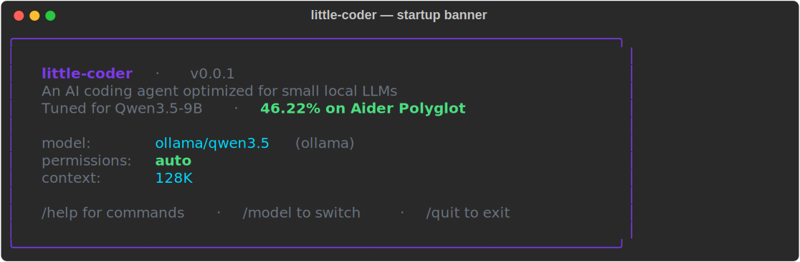
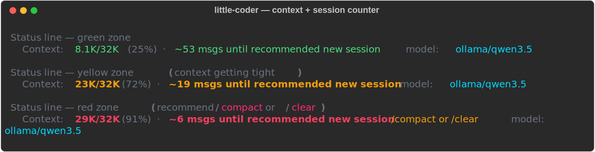
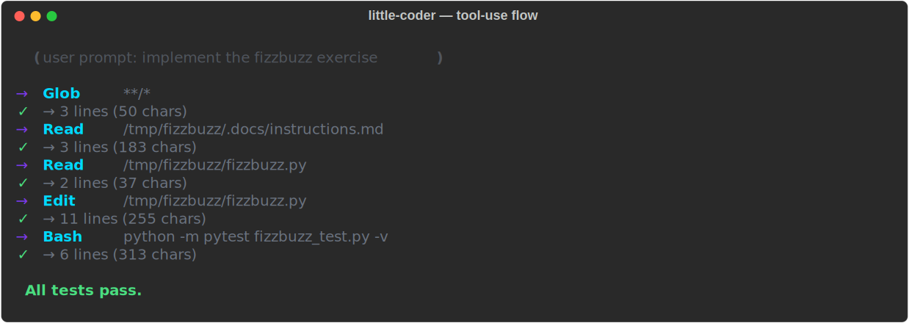
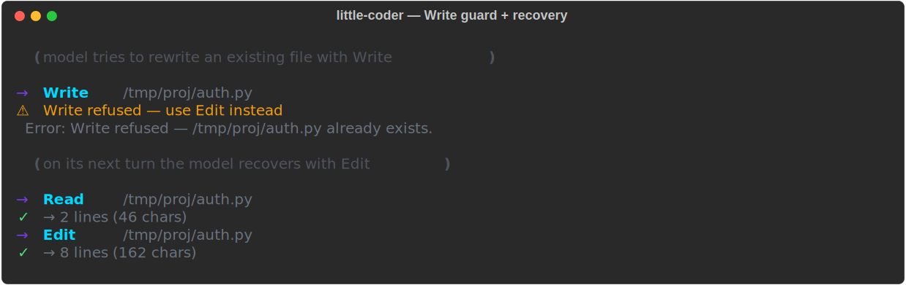

# little-coder

**A Claude Code-inspired CLI coding agent, heavily optimized for small models that run on any modern consumer laptop.**

little-coder takes the architecture of a cloud-powered coding assistant and makes it work with 5–10 GB local models served via Ollama, through skill-augmented tool use, domain-knowledge injection, workspace-aware context discovery, a Write-vs-Edit tool invariant, and a thinking-budget system that prevents reasoning models from hanging while preserving their partial insights.

**Headline result:** `ollama/qwen3.5` (9.7B, 6.6 GB) + little-coder scores **45.56% mean** (across two full runs) on the full 225-exercise Aider Polyglot benchmark, running on a consumer laptop with no network calls. On the public leaderboard that sits above gpt-4.5-preview (44.9%) and gpt-oss-120b high (41.8%). A matched-model vanilla Aider baseline reaches 19.11%.

> **The full narrative — motivation, design, methodology, results, leaderboard comparison, integrity audit, and limitations — is in the white paper at [`docs/whitepaper.md`](docs/whitepaper.md).** This README is the quick tour: what it looks like, how to run it, and how the repo is laid out. For anything about *why* the design is the way it is or *what the numbers mean*, read the paper.

---

## What it looks like



Every time you're about to type, the status line shows how much context you've burned and projects how many more messages you can send before a new session is recommended. Zones at 70% (yellow) and 85% (red) match the threshold that triggers automatic compaction:



When you ask little-coder to implement something, the agent uses the workspace-awareness skill to discover any spec file (`.docs/instructions.md`, `AGENTS.md`, `CLAUDE.md`, `README.md`), reads the stub, and then **Edits** it in place. On the occasions it tries to `Write` over an existing file, the tool-level guard refuses and hands the agent the exact Edit recipe for the same path:





All four screenshots are real Rich-rendered SVG exports regenerated from a local generator script — they update in sync with the codebase.

---

## Quick start

```bash
# 1. Install Ollama
curl -fsSL https://ollama.com/install.sh | sh

# 2. Pull a model
ollama pull qwen3.5

# 3. Clone little-coder
git clone https://github.com/itayinbarr/little-coder.git
cd little-coder

# 4. Install
pip install -e .

# 5. Run
python little_coder.py
# Then in the REPL:  /model ollama/qwen3.5
```

---

## Supported models

| Model | Size | Notes |
|---|---|---|
| **Qwen3.5** (default) | 6.6 GB | 9.7B, thinking + tools, the model the headline 45.56% is from |
| Gemma4:e4b | 9.6 GB | 8B, vision + audio capable |
| Qwen3:8b | 5.2 GB | 8.2B, thinking + tools |
| Gemma3:4b | 3.3 GB | 4B, 8K context, needs all optimizations |
| Llama 3.2:3b | ~2 GB | 3B, tight context |
| Phi4-mini | ~3 GB | 16K context |
| Any cloud model | — | Claude, GPT-4, Gemini — small-model optimizations auto-disabled |

---

## CLI reference

```
python little_coder.py [options]
  --model MODEL        Set the model (e.g. ollama/qwen3.5)
  --permission-mode    auto | accept-all | manual | plan
```

### Key slash commands

| Command | Description |
|---|---|
| `/model <name>` | Switch model |
| `/context` | Show current context usage + message projection |
| `/compact` | Summarize old messages to free up context |
| `/commit` | Review and commit changes |
| `/review` | Code review with structured feedback |
| `/skills` | List available skills |
| `/memory` | View persistent memories |
| `/voice` | Voice input mode |
| `/help` | Full command reference |

---

## Repo layout

```
little_coder.py          # REPL, slash commands, rendering
agent.py                 # Core agent loop with small-model adaptations
providers.py             # Multi-provider streaming (Ollama, Anthropic, OpenAI-compat)
tools.py                 # 8 core tools + Write-vs-Edit invariant
tool_registry.py         # Tool registration and dispatch
context.py               # System prompt builder (base + skills + knowledge)
config.py                # Configuration management
compaction.py            # Context window management
workspace.py             # Workspace introspection helpers
memory.py                # Persistent file-based memory

local/                   # Small-model preprocessing pipeline
├── config.py            # Per-model profiles (context, tokens, budgets)
├── skill_augment.py     # Tool-skill selection and injection
├── knowledge_augment.py # Domain-knowledge selection and injection
├── context_manager.py   # Prompt compression and message pruning
├── quality.py           # Empty / hallucinated / looped response detection
├── output_parser.py     # Text-based tool-call extraction + JSON repair
└── deliberate.py        # Parallel reasoning branches

skill/
├── tools/               # Tool usage guidance (8 files)
├── knowledge/           # Algorithm + domain reference (13 files)
├── loader.py            # Skill file parser
├── executor.py          # Skill execution (inline/fork)
└── builtin.py           # Built-in slash skills

benchmarks/
├── aider_polyglot.py              # Multi-language benchmark harness
├── polyglot_status.py             # Status dashboard for running benchmarks
├── smoke_test_langs.sh            # Reference-solution smoke test per language
└── results_full_polyglot*.json    # Per-exercise results from full runs
```

---

## Further reading

- **[`docs/whitepaper.md`](docs/whitepaper.md)** — the white paper. Motivation, design philosophy (*intern, not senior engineer*), methodology, full results, leaderboard comparison, integrity audit, limitations. **Start here.**
- [`docs/benchmark-reproduction.md`](docs/benchmark-reproduction.md) — two-run reproduction report with per-language statistics, tool-use analysis, intervention metrics, and the runner-degradation investigation.
- [`docs/benchmark-baseline-aider.md`](docs/benchmark-baseline-aider.md) — vanilla Aider + Qwen3.5 baseline (19.1%) for scaffold-ablation comparison.
- [`docs/architecture.md`](docs/architecture.md) — deep internals for contributors: module dependency graph, tool registry API, skill loader structure.

---

## Citation

If you reference little-coder or its Aider Polyglot result in academic work, please cite the white paper:

```bibtex
@misc{inbar2026littlecoder,
  title        = {little-coder: A Coding Agent Optimized for Small Local Language Models},
  subtitle     = {Architectural Adaptation Lets a 9.7B Model Outperform Frontier Models on Aider Polyglot},
  author       = {Inbar, Itay},
  year         = {2026},
  month        = apr,
  howpublished = {\url{https://github.com/itayinbarr/little-coder/blob/main/docs/whitepaper.md}},
  note         = {White paper}
}
```

Plain-text form:

> Inbar, I. (2026). *little-coder: A Coding Agent Optimized for Small Local Language Models.* White paper. https://github.com/itayinbarr/little-coder/blob/main/docs/whitepaper.md

---

## Attribution

little-coder is a derivative work based on [CheetahClaws / ClawSpring](https://github.com/SafeRL-Lab/clawspring) by SafeRL-Lab, licensed under Apache 2.0. The upstream project provided the foundational agent architecture, tool system, multi-provider support, and REPL interface.

little-coder adds significant new systems for small-model optimization: skill-augmented tool use, domain-knowledge injection, workspace awareness, thinking-budget enforcement with reasoning reuse, the Write-vs-Edit tool invariant, model-specific profiles for Qwen3.5 and Gemma4, and a full multi-language benchmark harness.

---

## License

Apache 2.0 — see [LICENSE](LICENSE) for details.
