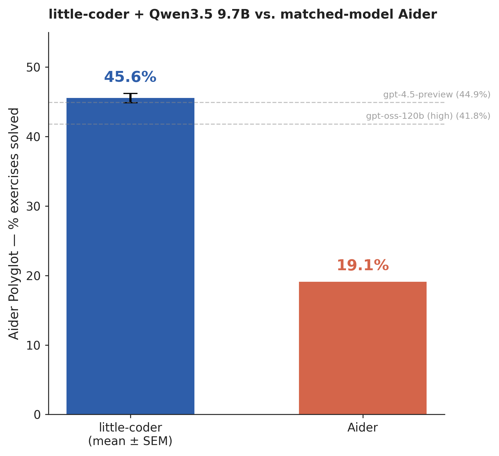
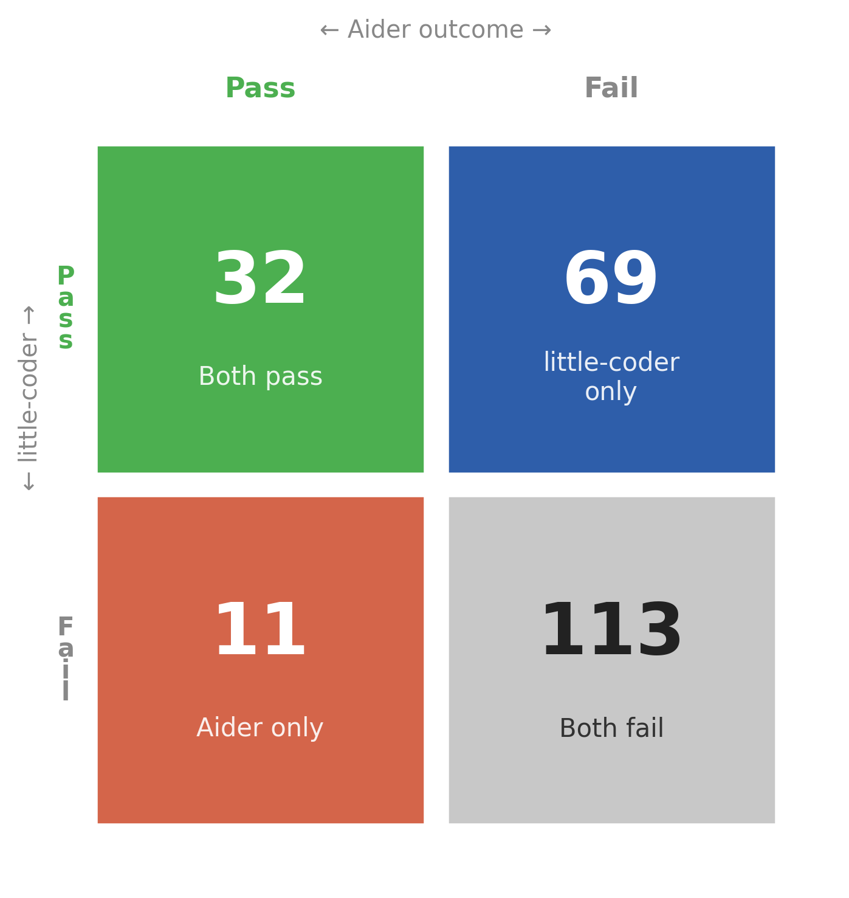
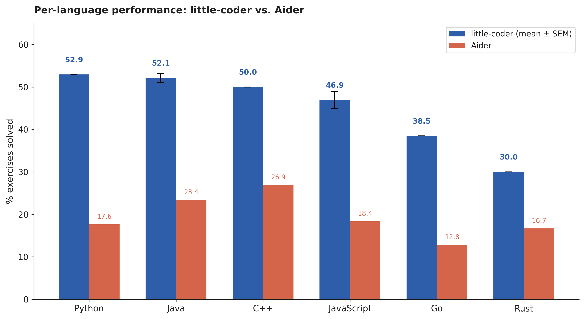
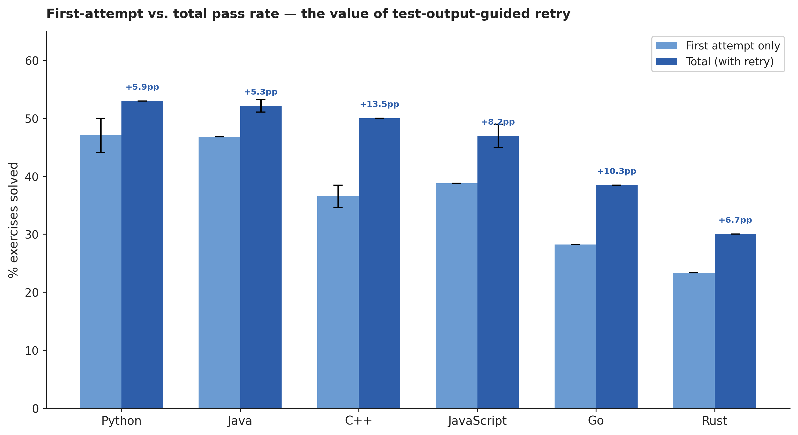
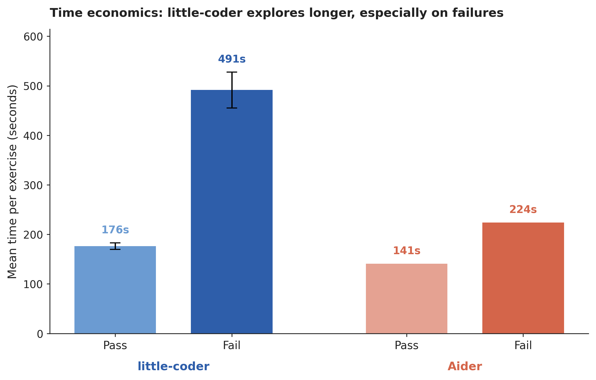

## Abstract

Small local language models often appear weak when they are placed inside coding agents designed around frontier-model assumptions. But how much of that weakness reflects model size, and how much reflects scaffold–model misalignment? I evaluate little-coder, a coding agent scaffold adapted to the Qwen3.5-9B model, on the Aider Polyglot benchmark. little-coder achieves 45.56% mean pass@2 across two full runs, outperforming a matched-model vanilla Aider baseline at 19.11% and exceeding several public leaderboard entries built on models more than 10× larger, including gpt-4.5-preview and gpt-oss-120b (high). These results show that scaffold–model fit can materially change practical coding performance for small local models. More broadly, they suggest that sub-10B models have been excluded from coding-agent evaluation prematurely: even the vanilla baseline is competitive with some larger leaderboard models, and scaffold adaptation makes that competitiveness unmistakable. Benchmark results in this regime therefore reflect not just model weights, but the interaction between model and scaffold.

*Figure 1. Overall benchmark performance: little-coder mean (±SEM across two complete runs) and the matched-model vanilla Aider baseline. Dashed lines mark public leaderboard entries that little-coder outperforms.*

## Introduction

Coding agents are built around assumptions of high autonomy, strong long-horizon planning, and reliable tool use. Those assumptions suit frontier models, which can hold a plan across many turns, self-correct after a malformed tool call, recover from a destructive edit, and decide on their own when reasoning has gone on long enough. A small local model placed inside the same scaffold inherits the same responsibilities without the same capabilities, and the result is that its failures are often read as evidence of model weakness when they may in fact be evidence of misalignment between the model and the agent wrapped around it.

The standard way to evaluate a coding agent treats the scaffold as fixed and the model as the variable. Under that framing, the performance of a 9B local model through Aider against the performance of GPT-4o through Aider looks like a model comparison. But the scaffold itself is a set of design decisions about how much self-management to expect from the model, how much context to inject, how aggressive to be about editing, and how to recover from failure. Those decisions were made for a different class of model. When the model changes, the appropriateness of those decisions is an open question, not a background assumption.

This paper takes the opposite framing. It holds the model constant, at Qwen3.5-9B in its Q4\_K\_M quantized form, and varies the scaffold. One scaffold is Aider run under its own defaults. The other is little-coder, an agent whose design has been adapted specifically to the behavioral profile of a small local model. The question I want to answer is whether redesigning the scaffold around the model, rather than redesigning the model to fit the scaffold, produces a measurable change in practical coding performance.

There is a secondary reason the question is worth asking. Public coding-agent leaderboards, and Aider's own polyglot dashboard in particular, do not currently report results for models under roughly ten billion parameters. The working assumption has been that sub-10B local models are not competitive enough at agentic coding to be worth benchmarking. Part of what this paper shows, almost as a side effect, is that the assumption is premature: even the vanilla baseline reported here, without any scaffold adaptation, scores above several larger models already on the public board. That observation is what makes the scaffold-variation question pressing. If small local models are within reach of being benchmarkable at all, then the scaffold that surrounds them becomes a first-order variable rather than a footnote.

## Methods

**Model setup.** Both systems under comparison use the same model weights. The model is `ollama/qwen3.5` in its 9.7-billion-parameter Q4\_K\_M quantization, totalling approximately 6.6 GB of weights, served through a local Ollama 0.20.5 instance running in Docker on an RTX 5070 Laptop and a 14900HX host. The context window is set to 32,768 tokens in both configurations. Temperature is 0.3 for little-coder and 0 for Aider, each matching the default for its respective scaffold. No fine-tuning, LoRA, or weight-level modification is applied in either configuration. 

**Benchmark.** The benchmark is the Aider Polyglot suite in its full 225-exercise form, covering Python, Go, Rust, JavaScript, C++, and Java. Each exercise is copied into a clean workspace before the agent begins, and grading is performed by that language's native test runner rather than by any agent-facing inspection. Each exercise receives up to two attempts, with the second attempt seeing the failing test output from the first. An exercise is counted as solved if either attempt passes. A test-file audit was performed on the little-coder runs to rule out the obvious objection that the agent could have solved exercises by editing tests rather than implementations. Across all 225 exercises, only six involved any edit to a test file; four of those still failed, and the two that passed were manually confirmed to be benign edits such as comment removal, leaving the test logic intact.

**Baseline setup.** The matched-model baseline runs Aider 0.86.2 through its official benchmark harness from the `Aider-AI/aider` source repository, invoked natively rather than inside Aider's Docker image. Aider's defaults are preserved where they describe the scaffold itself: whole-file edit format, temperature 0, and two attempts per exercise. Two inference-level defaults were changed, in both cases to prevent the baseline from losing exercises to infrastructure issues rather than to scaffold limitations. Aider's default context window is well below 32,768 tokens, and leaving it at default would have meant the baseline ran on a smaller context than little-coder on the same model, which would conflate context-window differences with scaffold differences. Raising `num_ctx` to 32,768 matches what the model is given in the little-coder configuration. Similarly, litellm's default request timeout is 600 seconds, which on this hardware is short enough that long generations on CPU-offloaded KV cache would time out and be recorded as failures for reasons unrelated to the agent's behavior. Raising the timeout to 1,800 seconds prevents that failure mode. A per-exercise wall-clock cap of 3,600 seconds was installed as a runaway-generation safeguard, as it was observed to be stuck on three exercises before an output-length cap was added mid-run, after which it never fired again. Two infrastructure fixes were applied to Aider's harness to make it run outside Docker: a path-resolution patch for the test-runner scripts, which Aider hard-codes to `/aider/benchmark/...` paths, and the wall-clock cap described above. None of these changes touches Aider's prompts, coder logic, retry mechanics, or edit-parsing code.

**Agent loop.** The little-coder scaffold inherits its core structure, including the multi-turn agent loop, the tool abstraction layer, and the REPL interface, from the `SafeRL-Lab/clawspring` agent substrate. The adaptations that define little-coder sit on top of that substrate and are the subject of this paper. A central design choice is that the Write tool refuses to operate on a file that already exists and returns a structured error directing the model to Edit instead, so that a whole-file rewrite cannot silently replace a file that already contains partially working code. Reasoning is bounded by a 2,048-token thinking budget; when the budget is exceeded, generation is aborted, the partial reasoning trace is preserved and reinjected as assistant context, and the request is retried with thinking disabled, which forces the model out of open-ended deliberation and back into committing to an implementation. Workspace discovery is made explicit through a conditional-injection knowledge entry that fires on coding keywords and directs the model to surface local instructions and documentation, such as `.docs/instructions.md` and `README.md`, before editing any code. Reference material is provided through two small-budget channels rather than a large static preamble: tool skill cards, at roughly 80 to 150 tokens each, selected per turn by intent prediction, recency, and error-recovery signals; and algorithm cheat sheets, scored against the user message and injected only when their keywords match. Together these two channels are capped at approximately 500 tokens per turn, or about one and a half percent of the context window. A malformed-output parser and a quality monitor sit around the agent loop itself, repairing tool calls that the small model emits in fenced or otherwise non-native form, catching empty responses and hallucinated tool names, and aborting repetitive loops that would otherwise exhaust the turn budget on the same failing approach. Where a frontier-model scaffold can assume that the model will self-regulate across each of these dimensions, little-coder turns each of them into infrastructure.

## Results

**The vanilla Aider baseline.** Before comparing scaffolds, it is worth looking at the vanilla Aider baseline as a standalone result, because it is surprising in ways that the scaffold comparison itself does not bring out. Vanilla Aider with Qwen3.5-9B on the full 225-exercise polyglot benchmark, with context and timeout matched to the little-coder configuration and no scaffold-level modifications, solved 43 exercises for a pass rate of 19.11% in 15 hours and 39 minutes of wall time. The per-language rates range from 12.8% on Go to 26.9% on C++. This is the first result I am aware of that places a sub-10B quantized local model at measurable performance on Aider Polyglot under the benchmark's standard configuration. The public Aider Polyglot leaderboard does not currently report results for models below roughly ten billion parameters, on the implicit assumption that such models are not competitive enough at agentic coding to be worth the slot. The baseline reported here scores above several larger models on the same benchmark. One of the incidental conclusions of this work is therefore that the sub-10B local-model regime has probably been excluded from the coding-agent evaluation conversation prematurely, and that it is time to include smaller models in these benchmarks as a matter of course.

**The little-coder result.** Across two complete end-to-end runs of the same 225-exercise benchmark on the same hardware and the same model weights, little-coder solved a mean of 102.5 exercises, for a mean pass rate of 45.56% (SD=0.94). Four of the six language tracks reproduced their pass counts exactly across the two runs; of the 225 exercises, 79.1% produced the same pass-or-fail outcome in both runs, placing the reproducibility of the headline number well inside the noise floor that would be expected. The rest of this section reports the mean across the two runs, because the purpose of running twice was to characterize variance, and the individual runs do not carry independent interpretive weight once variance has been shown to be small.

**Scaffold's mechanisms.** The scaffold's design decisions leave observable traces. The Write-tool guard fires on approximately 57% of exercises, meaning that on more than half the benchmark, the model attempted a whole-file rewrite of an existing file at least once and was redirected to Edit; without the tool-level refusal, each of those attempts would have been an opportunity to silently destroy working code. The thinking-budget cap fires approximately 0.90 times per exercise on average, indicating that unbounded reasoning would have run past the 2,048-token budget on nearly every exercise, either consuming implementation tokens or hanging the context window entirely. Workspace discovery is heavily used: Glob is invoked on 67% of exercises and Read on 100%, which means the model does in fact surface local documentation before acting, as the knowledge entry directs. The second-attempt retry path contributes roughly 18% of all passes, or about eight percentage points of the final score; removing the retry mechanism drops the headline from 45.56% to 37.6%. These observables are not formal ablations, and they should not be read as causal estimates of each mechanism's contribution in isolation, but they do establish that the scaffold's protective and directive machinery was active throughout the run rather than dormant.

**The matched-model comparison.** The cleanest result in the paper is the one that holds the model constant and varies only the scaffold. On the full 225-exercise benchmark, little-coder solves 101 exercises and vanilla Aider solves 43, for a gap of 26.5 percentage points. Of the 225 exercises, 32 are solved by both systems, 113 are failed by both, 69 are solved by little-coder and failed by Aider, and 11 are solved by Aider and failed by little-coder. The asymmetry between the 69-exercise cell and the 11-exercise cell is the scaffold signal: on 69 exercises, the model is demonstrably capable of producing a passing solution, and the vanilla scaffold does not reach that solution. The inverse cell, where Aider succeeds and little-coder fails, is about six times smaller and sits within the stochastic frontier observed between little-coder's own two runs.

*Figure 2. Cross-scaffold outcome overlap on all 225 exercises. The asymmetry between the little-coder-only cell (69) and the Aider-only cell (11) is the scaffold signal.*

**Language-level performance.** little-coder's strongest languages are Python and Java, at around 53% and 52% respectively, with C++ and JavaScript close behind. The weaker languages are Go at 38.5% and Rust at 30.0%. The scaffold gap relative to vanilla Aider is widest in Python, at 35.3 percentage points, and narrowest in Rust, at 13.3 percentage points. The two observations are related: the languages where the scaffold helps most are the ones where iterative test-guided refinement, workspace discovery, and controlled editing carry the most weight, while the languages where the scaffold helps least are the ones where a hard compile-time or borrow-checker constraint narrows the available search space regardless of how the agent is organized. 

*Figure 3. Per-language pass rates for little-coder (mean ± SEM) and the matched-model vanilla Aider baseline.*

**First-attempt and retry contributions.** About 82% of little-coder's passes arrive on the first attempt, and the remaining 18% come from the second-attempt retry path, in which the agent sees the failing test output and gets one additional try. That division is fairly stable across both runs, but its magnitude varies meaningfully across languages: in C++, the retry path is worth 13.5 percentage points on top of first-attempt performance, while in Java it is worth only 5.3 percentage points. The pattern suggests that C++ is a language where the model often produces almost-correct code that fails on a specific edge case, and where the test output is detailed enough to guide a focused second pass, whereas Java's test output tends either to confirm a correct implementation or to reflect a structural problem that a single retry cannot resolve. 

*Figure 4. First-attempt pass rate versus total pass rate for little-coder, broken down by language.*

**Time economics.** The two scaffolds make different time-budget tradeoffs. Aider averages 141 seconds on passing exercises and 224 seconds on failing ones, for a fail-to-pass ratio of about 1.6. little-coder averages 177 seconds on passing exercises and 492 seconds on failing ones, for a fail-to-pass ratio of about 2.8. Aider's whole-file two-try structure terminates failures quickly: two LLM calls, two test runs, and the exercise is closed. little-coder's multi-turn agent loop continues exploring up to its 20-turn budget, and on hard failures it tends to exhaust most of that budget before giving up. The additional wall time little-coder spends on failures is the price of the passes it converts out of the scaffold-delta set. Per-hour throughput still favors little-coder, at approximately 4.7 passes per hour of benchmark wall time compared to 2.75 for Aider, so the longer time-per-exercise does not erase the pass advantage; it does, however, mean that more than half of little-coder's wall time is spent on exercises it ultimately fails, which is a natural target for future work on early-termination heuristics.

*Figure 5. Mean time per exercise for passing and failing outcomes in little-coder and vanilla Aider.*

## Discussion

The headline finding of this paper is that, on a matched-model comparison under the Aider Polyglot benchmark, redesigning the scaffold around the behavioral profile of a small local model moves the pass rate from 19.11% to 45.56%, a gap of that is not attributable to the model. The mechanism-level observables explain, at a descriptive level, why the gap appears where it does. The Write guard intervened on more than half the benchmark. The thinking budget fired approximately once per exercise. Workspace discovery was used on two-thirds of exercises. 

The evidence speaks directly to Aider Polyglot with a local Qwen3.5-9B backbone, and the transfer of these findings to SWE-bench, to real pull-request workflows, or to other small-model backbones has not been established and is left to future work. The observables reported in the results section are not ablations: they show that each mechanism was active, not what the pass rate would have been with a given mechanism disabled. Formal per-mechanism ablations would let me assign causal weight to each intervention rather than treating them collectively, and are the natural next step. The native-execution baseline required infrastructure fixes to run Aider's harness outside its Docker image, together with a context and timeout adjustment to match the capabilities given to little-coder and an output-length cap to mitigate runaway generation; none of these changes touches Aider's scaffold, prompts, retry logic, or edit-parsing, but they are changes nonetheless and are stated explicitly for reproducibility. Multi-hour local inference turned out to be an experimental variable in its own right, because Ollama's runner subprocess was observed to die and be replaced mid-benchmark in contaminated runs outside the two clean ones reported here, with measurable post-replacement degradation, which makes inference-runtime stability part of the experimental story rather than a background implementation detail.

Residual failures fall into a small number of recognizable patterns, and disentangling them is part of what makes the scaffold-versus-model question tractable. Some failures are search failures that end in max-turn exhaustion, where the agent was cycling through hypotheses that never converged. Some reflect language regimes where compile-time burden consumes the turn budget before runtime feedback becomes useful, which is most visible in Rust and to a lesser extent Go. Others are algorithmic ceiling tasks, including book-store, bowling, forth, react, and zebra-puzzle, which both scaffolds consistently fail across most or all languages. The algorithmic ceiling tasks mark the subset of the benchmark where the model itself, rather than the scaffold, is the binding constraint. 

On a controlled benchmark with a matched-model comparison in view, a large portion of the practical gap between a small local model and the expectations set by frontier-model coding agents can be recovered when the scaffold is redesigned around the behavioral constraints of the model actually being used. The redesign shows is that benchmark outcomes for coding agents are properties of model weights in interaction with the agent that surrounds them, rather than properties of model weights alone. On this benchmark and at this model scale, the interaction is load-bearing.
